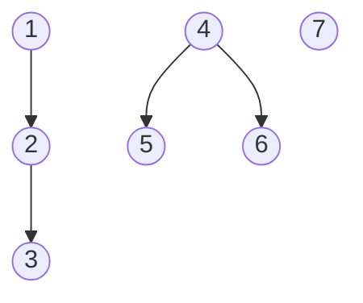
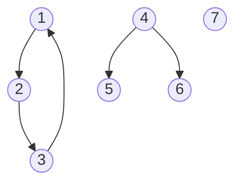

# Grafos

A partir de un grafo y sus arcos, vamos a calcular:

* las **componentes conexas** del grafo si los arcos se consideran no dirigidos
* las **componentes fuertemente conexas** de un grafo si los arcos se consideran dirigidos

Vamos a usar perspectiva didáctica, usando el lenguaje de programación Ruby.

# 1. Teoría

Empezamos conrextualizando un poco de teoría y luego pasamos a la práctica.

## 1.1 Definiciones

* Un **grafo** es una estructura de datos que representa relaciones entre objetos. Se define formalmente como un conjunto de vértices conectados por aristas.
* Un **nodo** (o vértice) es la unidad básica de un grafo. Representa a un objeto o una entidad individual dentro del sistema.
* Un **arco** (o arista) es la conexión o relación que existe entre dos nodos. Indica que hay un camino o un vínculo entre ellos.
* En un **grafos dirigidos** el arco tiene una dirección (un sentido). Se representa con una flecha (ej. 1 -> 2). 
* En un **grafos no dirigidos** la relación es bidireccional; si 1 está conectado con 2, se asume que 2 también lo está con 1.

## 1.2 Calcular las componenentes conexas

**Componentes Conexas (Grafos No Dirigidos)**: En un grafo no dirigido, una componente conexa (CC) es un grupo de nodos donde cualquier par de ellos está conectado por un camino.

Algoritmos:

* Búsqueda en Anchura (BFS) o Profundidad (DFS)

**Componentes Fuertemente Conexas (Grafos Dirigidos)**: En los grafos dirigidos, una componente fuertemente conexa (CFC) es un grupo de nodos donde, para cada par `(u,v)`, existe un camino de `u` a `v` y también de `v` a `u`.

Algoritmos:

* El **algoritmo de Kosaraju**. Utiliza dos pasadas de DFS y el concepto de "grafo transpuesto" (invertir todas las flechas).
* El **algoritmo de Tarjan**: Sólo requiere una sola pasada de DFS.

# 2. Práctica

## 2.1 Ficheros de entrada

* [Ejemplos](./data/) de ficheros de entrada.

Los ficheros de entrada, son ficheros de texto plano con el siguiente formato:

* En la primera fila, el número de nodos del grafo. Si por ejemplo, tenemos un grafo de 4 nodos, entonces los nodos se identifican como 1, 2, 3, y 4.
* En las filas restantes (de 0 a un valor no determinado) definiremos los arcos.
* Cada arco se define en una fila con dos valores numéricos `N1 N2`:
    - El primer número N1 es el identificador del nodo de donde parte el arco. El origen del arco.
    - En segundo número N2 es el identifcador del nodo hacia donde se dirige el arco. El destino del arco.
* Aunque en el fichero de entrada los arcos se definen con dirección. Internamente en la implementación, tendremos en cuenta o no la dirección de los arcos según nos interese en cada momento.

# 2.2 Ejecución

> **REQUISITO**: Necesitamos tener Ruby instalado en nuestro equipo para ejecutar el programa.
>
> * `sudo apt install`, en Debian.
> * `sudo zypper install`, emn OpenSUSE.

* `ruby main.rb data/grafo1.txtx`, para ejecutar el programa con los datos del fichero `data/grafo1.txt`.

La salida por pantalla muestra lo siguiente:

* `filename`: El nombre del fichero de entrada.
* `nodes`: El número de nodos del grafo.
* `arcs`: Son los arcos del fichero de entrada.
* `cc`: Son las componentes conexas que se han calculado, usando los arcos sin dirección.
* `cfc`: Son las componentes fuertemente conexas que se han calculado, teniendo en cuando la dirección de los arcos.

## 2.3 Ejemplo grafo1

* Contenido del fichero `data/grafo1.txt`:

```text
7
1 2
2 3
4 5
4 6
```

* Esquema del grafo:



* Ejecutar el programa con los datos del fichero `data/grafo1.txt`:

```bash
$ ruby main.rb data/grafo1.txt 

Graph (filename: data/grafo1.txt)
  > nodes (7)
  > arcs  (4)
    | 1 --> 2
    | 2 --> 3
    | 4 --> 5
    | 4 --> 6
  > cc  (3)
    | cc  1 ==> [1, 2, 3]
    | cc  2 ==> [4, 5, 6]
    | cc  3 ==> [7]
  > cfc (7)
    | cfc 1 ==> [1]
    | cfc 2 ==> [2]
    | cfc 3 ==> [3]
    | cfc 4 ==> [4]
    | cfc 5 ==> [5]
    | cfc 6 ==> [6]
    | cfc 7 ==> [7]
```

## 2.4 Ejemplo grafo2

* Contenido del fichero `data/grafo2.txt`:

```text
7
1 2
2 3
3 1
4 5
4 6
```

* Esquema del grafo:



* Ejecutamos el programa con los datso del grafo:

```bash
$ ruby main.rb data/grafo2.txt 
Graph (filename: data/grafo2.txt)
  > nodes (7)
  > arcs  (5)
    | 1 --> 2
    | 2 --> 3
    | 3 --> 1
    | 4 --> 5
    | 4 --> 6
  > cc  (3)
    | cc  1 ==> [1, 2, 3]
    | cc  2 ==> [4, 5, 6]
    | cc  3 ==> [7]
  > cfc (5)
    | cfc 1 ==> [1, 2, 3]
    | cfc 2 ==> [4]
    | cfc 3 ==> [5]
    | cfc 4 ==> [6]
    | cfc 5 ==> [7]
```

* Salida con depuración:

```bash
$ ruby debug.rb data/grafo2.txt 
Graph (filename: data/grafo2.txt)
  > nodes (7)
  > arcs  (5)
    | 1 --> 2
    | 2 --> 3
    | 3 --> 1
    | 4 --> 5
    | 4 --> 6
  > cangotos:
    | node 1 -> 2, 3
    | node 2 -> 3, 1
    | node 3 -> 1, 2
    | node 4 -> 5, 6
    | node 5 -> 
    | node 6 -> 
    | node 7 -> 
  > cc  (3)
    | cc  1 ==> [1, 2, 3]
    | cc  2 ==> [4, 5, 6]
    | cc  3 ==> [7]
  > cfc (5)
    | cfc 1 ==> [1, 2, 3]
    | cfc 2 ==> [4]
    | cfc 3 ==> [5]
    | cfc 4 ==> [6]
    | cfc 5 ==> [7]
```

# 3. El algoritmo con **can-go-to**

Este programa se basa en la estructura de datos `cangotos[]` para calcular las `cc`y las `cfc`.

La estructura de datos `cangotos[i]`, establece para un nodo `i`, cuáles son los nodos a los que se puede llegar avanzando los por arcos (aristas) teniendo en cuanta su dirección (o sentido).

## 3.1 Estructura del programa

Ficheros del proyecto:

```
grafo
├── lib
│   ├── calculate.rb
│   ├── graph.rb
│   ├── load.rb
│   └── show.rb
├── debug.rb
└── main.md
```

* `main.rb`: es el fichero principal del proyecto.
    1. Lee el argumento
    2. Crea un objeto `Graph`.
    3. Carga el `FILENAME`.
    4. Hace los cálculos y muestra por pantalla.
* `lib/`: En esta carpeta están las definiciones de las clases.
* `lib/graph.rb`: Define la clase `Graph`.
* `lib/load.rb`: Define los métodos para cargar el contenido del fichero.
* `lib/show.rb`: Define los métodos que muestran los datos por pantalla.
* `lib/calculate.rb`: Define los métodos que realizan los cálculos.
* `debug.rb`: es igual que `main.rb`, pero muestra más información por pantalla.

## 3.2 Debug

Si ejecutamos el programa `debug.rb`con un grafo veremos que por pantalla aparce algo más llamado `cangotos`. Esta información se calcula internamente como un paso previo al cálculos de los `cc` y los `cfc`.

La variable `cangotos`, representa para cada nodo N el subconjunto de todos los nodos a los que se puede llegar avanzando por los arcos (aristas) teniendo en cuenta se sentido.

## 3.3 Ejemplo `data/grafo1.txt`

```bash
$ ruby ./debug.rb data/grafo1.txt

Graph (filename: data/grafo1.txt)
  > nodes (7)
  > arcs  (4)
    | 1 --> 2
    | 2 --> 3
    | 4 --> 5
    | 4 --> 6
  > cangotos:
    | node 1 -> 2, 3
    | node 2 -> 3
    | node 3 -> 
    | node 4 -> 5, 6
    | node 5 -> 
    | node 6 -> 
    | node 7 -> 
  > cc  (3)
    | cc  1 ==> [1, 2, 3]
    | cc  2 ==> [4, 5, 6]
    | cc  3 ==> [7]
  > cfc (7)
    | cfc 1 ==> [1]
    | cfc 2 ==> [2]
    | cfc 3 ==> [3]
    | cfc 4 ==> [4]
    | cfc 5 ==> [5]
    | cfc 6 ==> [6]
    | cfc 7 ==> [7]
```

Avanzando por los arcos dirigidos, tenemos que: 

* Desde el nodo 1, podemos llegar (`can go to`) a los nodos 2 y 3.
* Desde el nodo 2, podemos llegar al nodos 3.
* Desde el nodo 3, no llegamos a ningún nodo.
* Desde el nodo 4, podemos llegar (`can go to`) a los nodos 5 y 6.
* Desde los nodos 5, 6 y 7, no llegamos a ningún nodo.

> NOTA: Esta información de los `cangotos[i]`, nos será muy útil para calcular los `cc` y los `cfc` de forma sencilla.

## 3.4 Ejemplo `data/grafo2.txt`

```
$ ./debug.rb data/grafo2.txt 
Graph (filename: data/grafo2.txt)
  > nodes (7)
  > arcs  (5)
    | 1 --> 2
    | 2 --> 3
    | 3 --> 1
    | 4 --> 5
    | 4 --> 6
  > cangotos:
    | node 1 -> 2, 3
    | node 2 -> 3, 1
    | node 3 -> 1, 2
    | node 4 -> 5, 6
    | node 5 -> 
    | node 6 -> 
    | node 7 -> 
  > cc  (3)
    | cc  1 ==> [1, 2, 3]
    | cc  2 ==> [4, 5, 6]
    | cc  3 ==> [7]
  > cfc (5)
    | cfc 1 ==> [1, 2, 3]
    | cfc 2 ==> [4]
    | cfc 3 ==> [5]
    | cfc 4 ==> [6]
    | cfc 5 ==> [7]
```