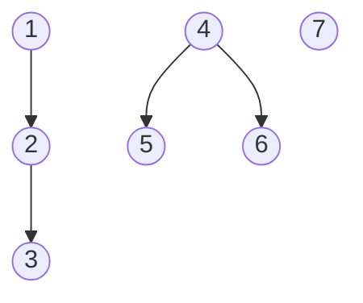
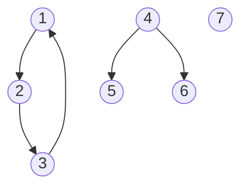

[<< back](../README.md)
---

# 2. Práctica

## 2.1 Ficheros de entrada

* [Ejemplos](./data/) de ficheros de entrada.

Los ficheros de entrada, son ficheros de texto plano con el siguiente formato:

* En la primera fila, el número de nodos del grafo. Si por ejemplo, tenemos un grafo de 4 nodos, entonces los nodos se identifican como 1, 2, 3, y 4.
* En las filas restantes (de 0 a un valor no determinado) definiremos los arcos.
* Cada arco se define en una fila con dos valores numéricos `N1 N2`:
    - El primer número N1 es el identificador del nodo de donde parte el arco. El origen del arco.
    - En segundo número N2 es el identifcador del nodo hacia donde se dirige el arco. El destino del arco.
* Aunque en el fichero de entrada los arcos se definen con dirección. Internamente en la implementación, tendremos en cuenta o no la dirección de los arcos según nos interese en cada momento.

## 2.2 Instalación

Necesitamos tener Ruby instalado en nuestro equipo para ejecutar el programa.

* En OpenSuse y MAC: viene por defecto.
* En Debian: `sudo apt install ruby`.
* Windows: https://rubyinstaller.org/. 

## 2.3 Ejecución

* `ruby main.rb data/grafo1.txtx`, para ejecutar el programa con los datos del fichero `data/grafo1.txt`.

La salida por pantalla muestra lo siguiente:

* `filename`: El nombre del fichero de entrada.
* `nodes`: El número de nodos del grafo.
* `arcs`: Son los arcos del fichero de entrada.
* `cc`: Son las componentes conexas que se han calculado, usando los arcos sin dirección.
* `cfc`: Son las componentes fuertemente conexas que se han calculado, teniendo en cuando la dirección de los arcos.

> Para ejecutar en modo **DEBUG**: `ruby debug.rb data/grafo1.txtx`.

## 2.4 Ejemplo grafo1

* Contenido del fichero `data/grafo1.txt`:

```text
7
1 2
2 3
4 5
4 6
```

* Esquema del grafo:



* Ejecutar el programa con los datos del fichero `data/grafo1.txt`:

```bash
$ ruby main.rb data/grafo1.txt 

Graph (filename: data/grafo1.txt)
  > nodes (7)
  > arcs  (4)
    | 1 --> 2
    | 2 --> 3
    | 4 --> 5
    | 4 --> 6
  > cc  (3)
    | cc  1 ==> [1, 2, 3]
    | cc  2 ==> [4, 5, 6]
    | cc  3 ==> [7]
  > cfc (7)
    | cfc 1 ==> [1]
    | cfc 2 ==> [2]
    | cfc 3 ==> [3]
    | cfc 4 ==> [4]
    | cfc 5 ==> [5]
    | cfc 6 ==> [6]
    | cfc 7 ==> [7]
```

## 2.4 Ejemplo grafo2

* Contenido del fichero `data/grafo2.txt`:

```text
7
1 2
2 3
3 1
4 5
4 6
```

* Esquema del grafo:



* Ejecutamos el programa con los datos del grafo:

```bash
$ ruby main.rb data/grafo2.txt 
Graph (filename: data/grafo2.txt)
  > nodes (7)
  > arcs  (5)
    | 1 --> 2
    | 2 --> 3
    | 3 --> 1
    | 4 --> 5
    | 4 --> 6
  > cc  (3)
    | cc  1 ==> [1, 2, 3]
    | cc  2 ==> [4, 5, 6]
    | cc  3 ==> [7]
  > cfc (5)
    | cfc 1 ==> [1, 2, 3]
    | cfc 2 ==> [4]
    | cfc 3 ==> [5]
    | cfc 4 ==> [6]
    | cfc 5 ==> [7]
```
